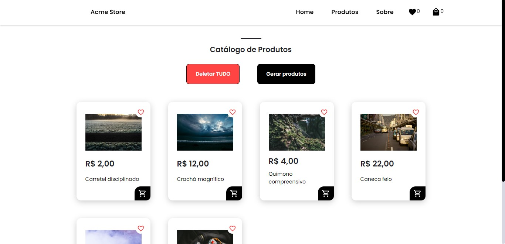

<!-- -->
<div align="center">

</div>

# Media Store - Ecommerce Example (Vue.js, VueX, Sass)

<p>Projeto desenvolvido por: <strong>Thiago Silva Lopes</strong>, em 06/2022.<br/>
Para o desafio técnico da vaga de Front End Jr, da DOT Digital Group.</p>

### Demo: https://vuex-media-store.vercel.app

<p> Instalar o projeto localmente, com a pasta "node_modules": </p>

```
yarn install
```

<p> Compilar/executar o projeto: </p>

```
yarn dev
```

<p>⚠ Esse projeto possui um API separada do aplicativo❗❗❗ Sendo assim, caso queira rodar esse app localmente, clone a API no repositório: <br/>
https://github.com/Thiagoow/API-VueX-EcommerceStore-JsonServer
</p>

<p align="center">(E mude a 'baseURL' em 'src/api/axios.js') </p>

<small>© Thiago Silva Lopes </small>
